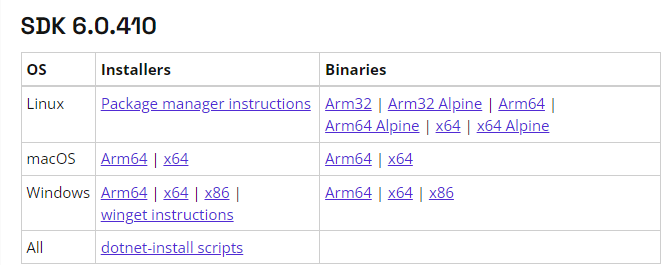
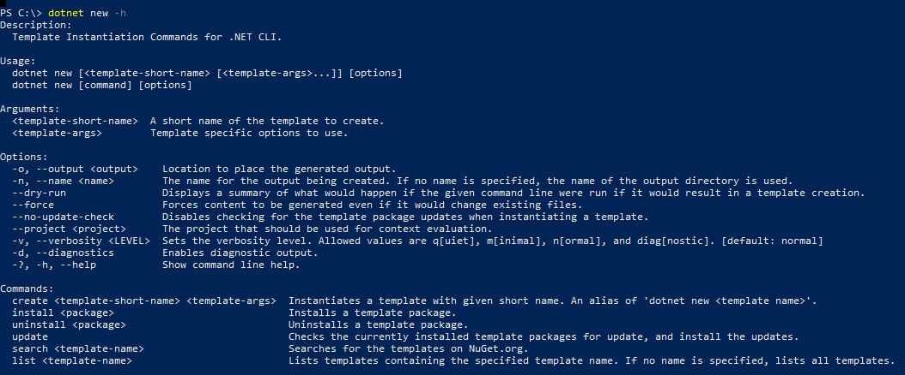
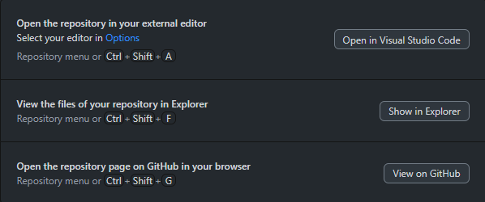

### Installation of .NET & Running a Console Application 

### Date Time: 29-June-2023 at 10:00 AM IST

## Prerequisites:

N/A

## Software/Tools

GIT BASH, GITHUB FOR DESKTOP, POWERSHELL, TERMINAL

## Languages:

N/A

## Information

## Information \| 100x100

## What are we doing today?

\> 1. Installation of .NET 6/7/8

\> 2. .NET commands

\> 3. Creating feature branch

\> 4. Publishing the feature branch

\> 5. Running a Console Application with Top Level Programs

\> 6. Running a Console Application without Top Level Programs

## 1. Installation of .NET 6/7/8

Install .NET 6/7/8 using the below link.

<https://dotnet.microsoft.com/en-us/download/dotnet>

## 

## {width="6.268055555555556in" height="2.501388888888889in"} 

Please make sure you download the Installers, depending on the Operating
System on your respective machines.

Once the download is finished, navigate to the downloaded folder, and
install the .NET 6/7/8 software. Please make sure you install them in
order i.e., first .NET 6 then 7 followed by 8, due to dependencies.

NOTE: Best practise to install any software is to "Run as
administrator".

## 2. .NET commands

\`dotnet\`

{width="3.8958333333333335in"
height="2.09375in"}

\`dotnet -h\`

{width="6.5in"
height="4.563888888888889in"}

\`dotnet --info\`

{width="6.5in"
height="5.795833333333333in"}

\`dotnet \--list-sdks\`

{width="6.5in"
height="1.4381944444444446in"}

\`dotnet new -h\`

{width="6.260416666666667in"
height="2.6041666666666665in"}

\`dotnet new list\`

{width="6.5in"
height="5.491666666666666in"}

\`dotnet new console -h\`

{width="6.5in"
height="3.6180555555555554in"}

## 3. Creating feature branch

Now open the GitHub for desktop

1.  Refresh the main branch.

2.  Remove the stale branches.

3.  Create the feature branch for the current task, branch format:
    **UserName/Date-task-description. Example --
    ravi/21june-T101-learning-csharp**

{width="4.615227471566055in"
height="1.9690244969378827in"}

{width="4.073485345581802in"
height="2.6566207349081363in"}

## 4. Publishing the feature branch

1.  **Publish the** feature branch by clicking on Publish branch.

> {width="6.355053587051619in"
> height="1.698153980752406in"}

2.  Now navigate to the folder by clicking on Show in Explorer

{width="6.230036089238845in"
height="2.604529746281715in"}

3.  Copy the path.

{width="6.5in"
height="1.7416666666666667in"}

4.  Switch back to the tool your using (Power Shell, cmd, Git Bash,
    Terminal)

5.  cd to the copied path

{width="4.344355861767279in"
height="1.6668996062992125in"}

\`dotnet new console -o firstsample \--dry-run\`

{width="4.21875in"
height="1.3854166666666667in"}

\`dotnet new console -o firstsample\`

\`dotnet restore\`

\`dotnet build\`

\`dotnet run\`

**Console Application with and without Top Level Statements**

> \`dotnet new console -o demo1 \--use-program-main\`
>
> {width="6.5in"
> height="3.4916666666666667in"}

## 6. Running a Console Application with Top Level Programs

## \`dotnet new console -o demo2\`

{width="6.5in"
height="3.638888888888889in"}
