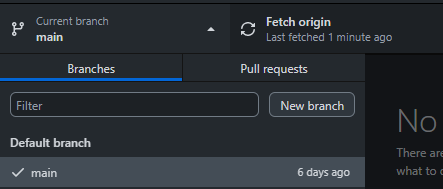

### Installation of .NET & Running a Console Application 

### Date Time: 29-June-2023 at 10:00 AM IST


## Prerequisites:

N/A

## Software/Tools

GIT BASH, GITHUB FOR DESKTOP, POWERSHELL, TERMINAL

## Languages:

N/A

## Information

## Information \| 100x100

## What are we doing today?

\> 1. Installation of .NET 6/7/8

\> 2. .NET commands

\> 3. Creating feature branch

\> 4. Publishing the feature branch

\> 5. Running a Console Application with Top Level Programs

\> 6. Running a Console Application without Top Level Programs

## 1. Installation of .NET 6/7/8

Install .NET 6/7/8 using the below link.

<https://dotnet.microsoft.com/en-us/download/dotnet>

 

Please make sure you download the Installers, depending on the Operating
System on your respective machines.

Once the download is finished, navigate to the downloaded folder, and
install the .NET 6/7/8 software. Please make sure you install them in
order i.e., first .NET 6 then 7 followed by 8, due to dependencies.

NOTE: Best practise to install any software is to "Run as
administrator".

## 2. .NET commands

 ```
dotnet
```

```
dotnet -h
```

```
dotnet --info
```


```
dotnet \--list-sdks
```


```
dotnet new -h
```


```
dotnet new list
```


```
dotnet new console -h
```


## 3. Creating feature branch

Now open the GitHub for desktop

1.  Refresh the main branch.

2.  Remove the stale branches.

3.  Create the feature branch for the current task, branch format:
    **UserName/Date-task-description. Example --
    ravi/21june-T101-learning-csharp**




## 4. Publishing the feature branch

1.  **Publish the** feature branch by clicking on Publish branch.


2.  Now navigate to the folder by clicking on Show in Explorer


3.  Copy the path.


4.  Switch back to the tool your using (Power Shell, cmd, Git Bash,
    Terminal)

5.  cd to the copied path


```
dotnet new console -o firstsample --dry-run
```


```
dotnet new console -o firstsample
```

```
dotnet restore
```

```
dotnet build
```

```
dotnet run
```

**Console Application with and without Top Level Statements**

 ```
 dotnet new console -o demo1 --use-program-main
```


## 6. Running a Console Application with Top Level Programs

```
dotnet new console -o demo2
```


